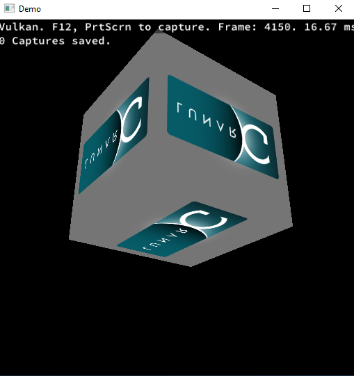
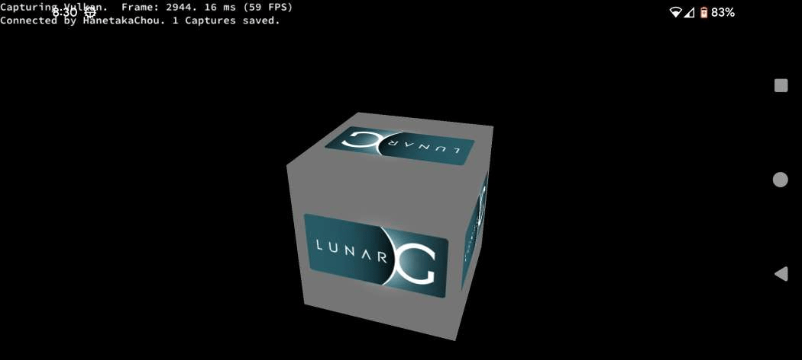

YAVC (Yet Another Vulkan Cube) is much closer to a real Vulkan application than the original [Vkcube](https://github.com/KhronosGroup/Vulkan-Tools/tree/master/cube) demo.  
- Distinguish "FRAME_THROTTLING_COUNT" and "swapchain_image_count". For more information: [Pipeline Throttling](https://community.arm.com/arm-community-blogs/b/graphics-gaming-and-vr-blog/posts/the-mali-gpu-an-abstract-machine-part-1---frame-pipelining).  
- Use [ring buffer](https://docs.microsoft.com/en-us/windows/win32/direct3d12/fence-based-resource-management#ring-buffer-scenario) and [dynamic offset](https://github.com/KhronosGroup/Vulkan-Samples/tree/master/samples/api/dynamic_uniform_buffers) to implement [Direct3D11 constant buffer](https://developer.nvidia.com/content/constant-buffers-without-constant-pain-0).  
- Distinguish "vkUpdateDescriptorSets" and "vkCmdBindDescriptorSets". For more information: [Vulkan-Resource-Binding](https://hanetakachou.github.io/Vulkan/Resource-Binding.html).  
- Use [staging buffer](https://github.com/google/angle/blob/chromium/5777/src/libANGLE/renderer/vulkan/vk_helpers.cpp#L4877) to upload assets.  

  

  

  

  
